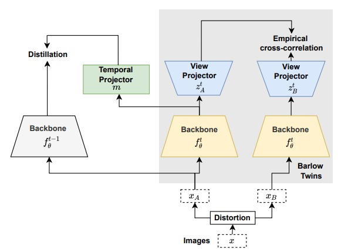

# Continually Learning Self-Supervised Representations with Projected Functional Regularization

This is the official repository for the paper:
> **[Continually Learning Self-Supervised Representations with Projected Functional Regularization](https://openaccess.thecvf.com/content/CVPR2022W/CLVision/html/Gomez-Villa_Continually_Learning_Self-Supervised_Representations_With_Projected_Functional_Regularization_CVPRW_2022_paper.html)**<br>
> [Alex Gomez-Villa](https://scholar.google.com/citations?user=A2dhwNgAAAAJ&hl=en), [Bartlomiej Twardowski](https://scholar.google.com/citations?user=8yywECgAAAAJ&hl), [Lu Yu](https://scholar.google.com/citations?user=8KhrWbYAAAAJ&hl=en&authuser=1), [Andrew D. Bagdanov](https://scholar.google.com/citations?user=_Fk4YUcAAAAJ&hl=en&authuser=1), [Joost van de Weijer](https://scholar.google.com/citations?user=Gsw2iUEAAAAJ&hl)<br>
> **CVPR 2022**

> **Abstract:** *Recent self-supervised learning methods are able to learn high-quality image representations and are closing the gap with supervised approaches. However, these methods are unable to acquire new knowledge incrementally -- they are, in fact, mostly used only as a pre-training phase over IID data. In this work we investigate self-supervised methods in continual learning regimes without any replay mechanism. We show that naive functional regularization, also known as feature distillation, leads to lower plasticity and limits continual learning performance. Instead, we propose Projected Functional Regularization in which a separate temporal projection network ensures that the newly learned feature space preserves information of the previous one, while at the same time allowing for the learning of new features. This prevents forgetting while maintaining the plasticity of the learner. Comparison with other incremental learning approaches applied to self-supervision demonstrates that our method obtains competitive performance in different scenarios and on multiple datasets.*
<br>

<p align="center" float="left">
     
    
</p>

NOTE: In order to make benchmarking easier, the current version of this code works inside the [CaSSLe](https://github.com/DonkeyShot21/cassle) implementation.

# Installation
Use the following commands to create an environment and install the required packages (needs `conda`):
```
conda create --name cassle python=3.8
conda activate cassle
conda install pytorch=1.10.2 torchvision cudatoolkit=11.3 -c pytorch
pip install pytorch-lightning==1.5.4 lightning-bolts wandb sklearn einops
pip install --extra-index-url https://developer.download.nvidia.com/compute/redist --upgrade nvidia-dali-cuda110
```

# Commands
Here below you can find a few example commands for running our code. The bash scripts with full training configurations for our continual and linear evaluation experiments can be found in the `bash_files` folder. Use our `job_launcher.py` to launch continual self-supervised learning experiments. We also provide example code for launching jobs with SLURM where you can pass the desired configuration for your job (bash script, data directory, number of GPUs, walltime, etc...).

NOTE: each experiment uses a different number of gpus (1 for CIFAR100, 2 for ImageNet100 and 4 for DomainNet). You can change this setting directly in the bash scripts.

## Fine-tuning
### CIFAR100
E.g. running Barlow Twins:
```
DATA_DIR=/path/to/data/dir/ CUDA_VISIBLE_DEVICES=0 python job_launcher.py --script bash_files/continual/cifar/barlow.sh
```
## PFR
After running fine-tuning, you can also run PFR by just loading the checkpoint of the first task. You will find all the checkpoints in your experiment directory (defaults to `"./experiments"`). Check the id of your run on WandB to make sure you are loading the correct checkpoint.
### CIFAR100
E.g. running Barlow Twins + PFR:
```
PRETRAINED_PATH=/path/to/task0/checkpoint/ DATA_DIR=/path/to/data/dir/ CUDA_VISIBLE_DEVICES=0 python job_launcher.py --script bash_files/continual/cifar/pfr_distill.sh
```

# Citation
If you like our work, please cite our [paper](https://openaccess.thecvf.com/content/CVPR2022W/CLVision/html/Gomez-Villa_Continually_Learning_Self-Supervised_Representations_With_Projected_Functional_Regularization_CVPRW_2022_paper.html):
```
@inproceedings{gomezvilla2022,
  title={Continually Learning Self-Supervised Representations with Projected Functional Regularization},
  author={Gomez-Villa, Alex and Twardowski, Bartlomiej and Yu, Lu and Bagdanov, Andrew and van de Weijer, Joost},
  booktitle={IEEE/CVF Conference on Computer Vision and Pattern Recognition},
  year={2022}
}